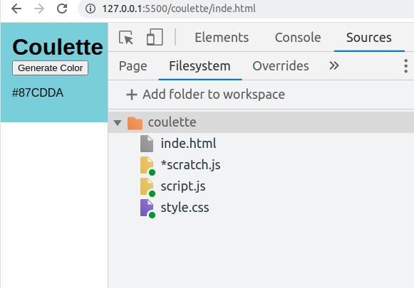

# Notes 2021-04-28


## Chrome DevTools

- talked about use-cases for the DevTools
   - live css styling in the browser for a client
   - live editing HTML
   - investigate Errors / Bugs / Performance / Usability 

- syncing "Filesystem" for persistent live editing:



- using the Chrome Debugger
  - setting basic Breakpoints
  - `stop`, `continue`, `step over`, `step into`
  - inspecting scope: `local`, `script`
  - inspecting the `call stack`
  - use `$0` in the DevTools-Console to access the currently selected DOM-Node
    
- dealing with a `for(;;);` 😈 infinite loop
  > 🤷 yeah - it's ugly and the DevTool do not help much <br>
  > Close the Tab and open a new one...

## More fun fun Functions

Function can be used as variables and parameters. When using them as variables the usual variable scoping applies.
```js
fn1() // fn1 is available here
function fn1() {
    return true
}
fn1() // fn1 is available here as well

fn2() // ERROR: fn2 is NOT available here
let fn2 = function() {
  return true
}
// fn2 is however available here
fn2() 
```

### Arrow Functions / lambdas

🍩 Mentioned "Syntactic Sugar" - which lambda / arrow functions to a certain degree.

```js
// this is bulky 
let fn2 = function() {
  return true
}

// more compact using an arrow function
let fn3 = () => {
  return true
}

// maximum compression
// true IS the return value
let fn4 = () => true
```

### lambdas in the wild

Compared javascript syntax and javascript "standard library" to human grammar and vocabulary. `array.forEach` would be grammer and the `() =>` construct the syntax. 

Checked out a few Array-function on MDN like: `push`, `pop`, `shift`, `includes`, `forEach`

Lambdas are very well suited for temporary / throwaway functions for example as a parameter.

```js
let array = ['a', 'bb', 'ccc']
{ // verbose way 
    let lengths = []
    for (let word of array) {
        lengths.push(word.length)
    }
}
{ // lambda + forEach 
  let lengths = []  
  array.forEach((word) => {
    lengths.push(word.length)
  })
}
{ // with map it's even nicer 
  let lengths = array.map((word) => word.length) 
}

```

### window IS global

Function example:
```js
window.my_function = () => console.log('my global function prints this')

window.my_function() // calling the function
my_function()
```

Array example:
```js
[] // this is just syntactic sugar
new Array() // this is the same as above
new window.Array() // which is the same as above as well
```

`window` has not just `window.document` but holds **all** global variables.

### prototype sneak peak

> On MDN we see e.g. `Array.prototype.map`. What does that mean?

All objects have a "secret" `__proto__` key where javascript will look for functions and properties if they are not present on the object directly. 

In the case of `array.forEach( () => console.log('test') )` the `forEach` function is found via the `__proto__`. This works for DOM-Nodes, Arrays, everything. It can be a nice way to find out what methods/functions an object supports.

All further details will be covered to a later time.


